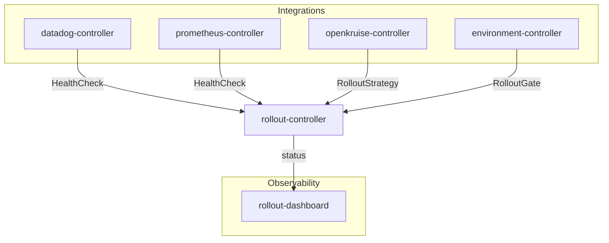

# Kuberik

**Kubernetes-native continuous delivery. Safe, hands-off deployments.**

[](LICENSE)
[](https://golang.org/)
[](https://github.com/kuberik/kuberik/actions/workflows/ci.yaml)
[](https://scorecard.dev/viewer/?uri=github.com/kuberik/kuberik)
[](https://github.com/kuberik/rollout-controller/releases/latest)
[](https://github.com/kuberik/kuberik/releases/latest)
[](https://kuberik.com)
[](https://github.com/kuberik/kuberik/stargazers)

> If Kuberik saves you from a bad deploy, consider [starring the repo](https://github.com/kuberik/kuberik/stargazers) — it helps others find the project.

Kuberik is declarative, multi-stage progressive delivery for Kubernetes - from commit to production, batteries included. It fills the gap that Flux and ArgoCD leave open: progressive delivery as Kubernetes-native CRDs, with no centralized pipeline, built-in health checks, deployment gates, and bake time - all reconciled by controllers that run in your cluster.

## Why Kuberik

- **No pipelines to maintain.** Rollouts are CRDs reconciled by in-cluster controllers. There is no Jenkins, no Tekton DAG, no Argo Workflow to keep alive.
- **Composes with Flux.** Kuberik does not replace your GitOps engine. It reads Flux `ImagePolicy` to discover releases and patches Flux source/kustomization resources to promote them.
- **Health and gate signals are decoupled.** Datadog, Prometheus, OpenKruise, GitHub Deployments, and custom controllers all produce `HealthCheck` / `RolloutGate` resources independently - the rollout engine just reads them.
- **Day-2 tools are first class.** A real CLI, a dashboard, structured controller logs, and a GitHub Action ship in the same release cycle as the controllers themselves.

## Features

| Feature | Description |
| --- | --- |
| **Multi-Stage Pipelines** | Promote releases across environments with dependencies between stages. |
| **Deployment Gates** | Control when and which releases deploy - with schedules, manual approvals, or custom conditions. |
| **Canary Rollouts** | Gradually roll out changes to a subset of users before full promotion. |
| **Automated Testing** | Run smoke tests, integration tests, or any verification Job as part of your rollout pipeline. |
| **Monitoring Integration** | Connect Datadog, Prometheus, or custom metrics to continuously validate deployments. |

## Install

### CLI

Homebrew:

```bash
brew install kuberik/tap/kuberik
```

`curl | bash` (Linux, macOS):

```bash
curl -s https://raw.githubusercontent.com/kuberik/kuberik/main/install/install.sh | sudo bash
```

Or download a release binary for Linux, macOS, or Windows from [Releases](https://github.com/kuberik/kuberik/releases/latest).

### Cluster (core controller only)

```bash
kuberik install
# or
kubectl apply -f https://github.com/kuberik/rollout-controller/releases/latest/download/install.yaml
```

### Cluster (core + all integration controllers)

```bash
kuberik install --all
# or, with kustomize
kubectl apply -k https://github.com/kuberik/kuberik/config/install
# or, with Helm (gh-pages repo)
helm repo add kuberik https://kuberik.github.io/kuberik
helm install kuberik kuberik/kuberik \
  --namespace kuberik-system --create-namespace \
  --set createNamespace=false \
  --set integrations.datadog.enabled=true \
  --set integrations.openkruise.enabled=true \
  --set integrations.environment.enabled=true
# or, with Helm (OCI registry, Helm 3.8+)
helm install kuberik oci://ghcr.io/kuberik/charts/kuberik \
  --namespace kuberik-system --create-namespace \
  --set createNamespace=false
```

See the [chart README](chart/kuberik/README.md) for the full values reference.

See [Getting Started](docs/getting-started.md) for a step-by-step walkthrough and [Installation](https://kuberik.com/docs/installation/) for per-component install commands.

### GitHub Actions

```yaml
- uses: kuberik/kuberik/action@main
  with:
    version: 'latest'
- run: kuberik version
```

See the [Action README](action/README.md) for more examples.

## Architecture



## Components

| Component | Purpose |
| --- | --- |
| [rollout-controller](https://github.com/kuberik/rollout-controller) | Core controller. Manages Rollout, RolloutGate, HealthCheck, and RolloutSchedule CRDs. |
| [rollout-dashboard](https://github.com/kuberik/rollout-dashboard) | Web UI for visualizing rollout status across namespaces. |
| [datadog-controller](https://github.com/kuberik/datadog-controller) | Creates kuberik HealthCheck resources from DatadogMonitor status. |
| [environment-controller](https://github.com/kuberik/environment-controller) | Reports deployment status to GitHub Deployments API; manages environment relationships. |
| [openkruise-controller](https://github.com/kuberik/openkruise-controller) | Integrates OpenKruise advanced rollout strategies with the Kuberik gate system. |
| [prometheus-controller](https://github.com/kuberik/prometheus-controller) | Creates HealthCheck resources from Prometheus alert and query results. |

## Documentation

Full documentation at [kuberik.com/docs](https://kuberik.com/docs/).

Docs also available in this repo:

- [Getting Started](docs/getting-started.md)
- [Installation](docs/installation.md)
- [CLI Reference](docs/cli.md)
- [Architecture](docs/architecture.md)
- [Concepts](docs/concepts.md)
- [API Reference](docs/api.md) - CRDs, annotations, status fields
- [Gates](docs/gates.md) - controlling when rollouts proceed
- [Health Checks](docs/healthchecks.md) - bake-period validation signals
- [Metrics](docs/metrics.md) - controller metrics and suggested alerts
- [Migration Guide](docs/migration.md) - from Argo Rollouts, Flagger, or kubectl apply
- [Upgrade Guide](docs/upgrade.md) - upgrade order, chart/controller compatibility, rollback
- [Operations Runbook](docs/operations.md) - day-2 ops, weekly/quarterly cadence, backups
- [Security Hardening](docs/security-hardening.md) - production posture
- [Troubleshooting](docs/troubleshooting.md) - common issues and fixes
- [FAQ](docs/faq.md)
- [Cheatsheet](docs/cheatsheet.md) - one-page reference
- [Examples](examples/) - copy-pasteable manifests for common setups

## Community and Contributing

- [CONTRIBUTING.md](CONTRIBUTING.md) - how to contribute
- [CODE_OF_CONDUCT.md](CODE_OF_CONDUCT.md) - community standards
- [ROADMAP.md](ROADMAP.md) - upcoming themes
- [ADOPTERS.md](ADOPTERS.md) - who uses Kuberik
- [RFCs](rfcs/README.md) - design proposal process
- [SECURITY.md](SECURITY.md) - reporting vulnerabilities
- [GitHub Discussions](https://github.com/kuberik/kuberik/discussions) - questions and ideas
- File bugs and feature requests via [GitHub Issues](https://github.com/kuberik/kuberik/issues)

## License

Apache 2.0 - see [LICENSE](LICENSE).
